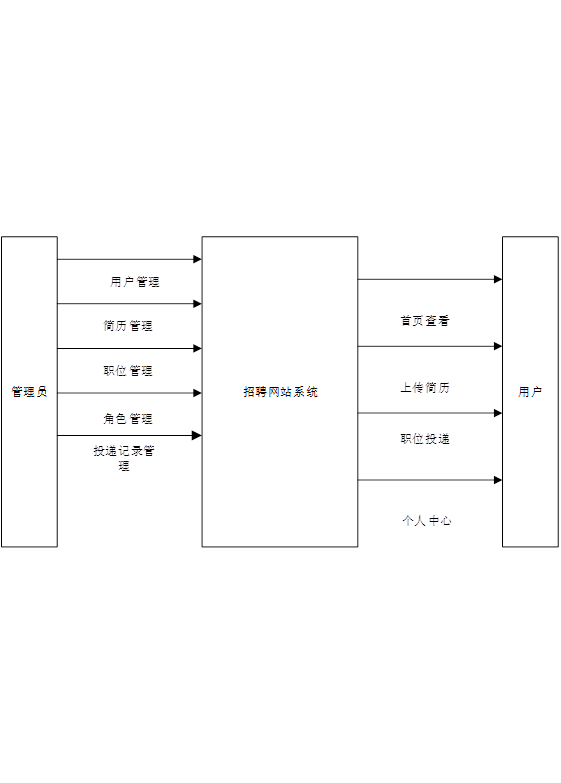
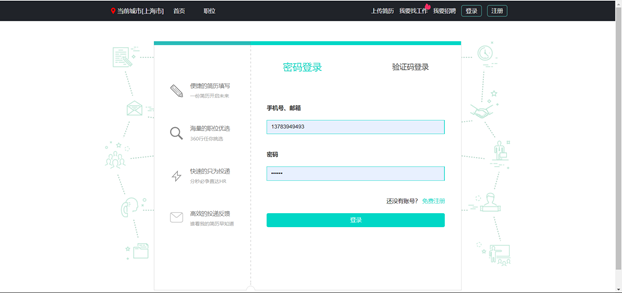
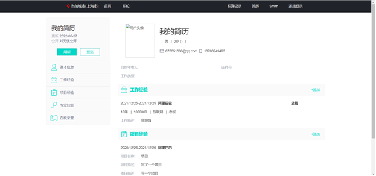
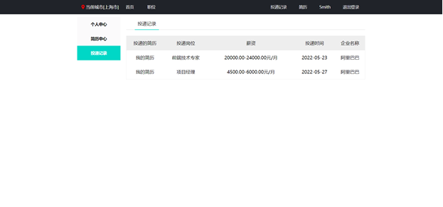
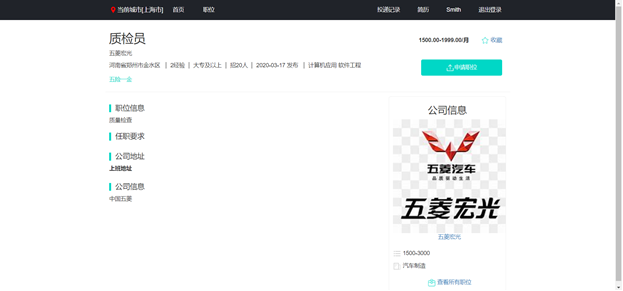

# my_zhapopin

#### 介绍
招聘网站，仿boss直聘的网站，可以在线修改简历，投递简历，架构是：springboot+mybatis+mybatis-plus+layui+mysql

#### 软件架构
软件架构说明

#### 系统截图

## 技术选型

| 技术                   | 版本   | 说明                                    |
| ---------------------- | ------ | --------------------------------------- |
| Spring Boot            | 2.1.6  | MVC核心框架                             |
| Spring Security oauth2 | 2.1.5  | 认证和授权框架                          |
| MyBatis                | 3.5.0  | ORM框架                                 |
| MyBatisPlus            | 3.1.0  | 基于mybatis，使用lambda表达式的         |
| Swagger-UI             | 2.9.2  | 文档生产工具                            |
| Hibernator-Validator   | 6.0.17 | 验证框架                                |
| redisson               | 3.10.6 | 对redis进行封装、集成分布式锁等         |
| hikari                 | 3.2.0  | 数据库连接池                            |
| log4j2                 | 2.11.2 | 更快的log日志工具                       |
| fst                    | 2.57   | 更快的序列化和反序列化工具              |
| orika                  | 1.5.4  | 更快的bean复制工具                      |
| lombok                 | 1.18.8 | 简化对象封装工具                        |
| hutool                 | 4.5.0  | 更适合国人的java工具集                  |
| swagger-bootstrap      | 1.9.3  | 基于swagger，更便于国人使用的swagger ui |

